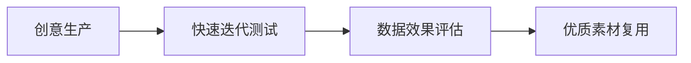

# Facebook广告高效运营全链路解决方案

---

## 一、基础搭建与优化
### 1.1 账号管理规范
- **内容更新频率**：每周至少发布3次自然贴文
- **网络环境配置**：每账号独立IP+设备指纹管理
- **安全防护措施**：双重认证+行为验证系统
- **信息完整性**：商业主页描述需包含5个核心关键词

---

## 二、定向技术矩阵
### 2.1 动态受众构建
| 层级 | 数据类型 | 组合逻辑 | 刷新周期 | 排除规则 |
|------|----------|----------|----------|----------|
|一级定位|人口特征|年龄×性别×语言|实时更新|180天购买者|
|二级扩展|兴趣行为|AI生成词库×人工优化|每48小时|低互动用户|
|三级触达|用户行为|浏览/加购/支付|事件触发|当日转化者|
|四级召回|失活用户|30天无互动用户|每周更新|7天复购客|

### 2.2 兴趣词策略
- **生成工具链**：ChatGPT词库扩展+语义匹配算法
- **组合公式**：（核心词+场景词）×（长尾词-否定词）
- **测试矩阵**：每组包含2视频+3图文组合方案

---

## 三、创意生命周期管理
### 3.1 智能测试流程

- **测试周期**：视频素材3天/图文素材24小时
- **成功率标准**：CTR>2.5%且CPM<$15

### 3.2 广告文案优化
| 文案模型 | 适用场景 | 关键词结构 | 效果指标 |
|----------|----------|------------|----------|
|PAS模型|新品推广|痛点唤醒+方案提供+效果承诺|转化率提升35%|
|FAB法则|产品升级|功能演绎+价值转化+利益点|ROI提高28%|
|AIDA公式|品牌曝光|注意捕获+兴趣激发+欲望建立|CTR提升42%|

---

## 四、数据驱动优化体系
### 4.1 实时监测仪表盘
| 数据纬度 | 预警阈值 | 自动应对策略 |
|----------|----------|--------------|
|CPM异常值|同比变化>25%|系统自动暂停并排查|
|CTR衰减|3小时内下降>30%|立即替换首帧画面|
|CPA超支|高出均值50%|调整投放时段分布|
|ROAS下滑|连续5小时<1.5|触发素材AB测试|

### 4.2 预算调控模型
- **弹性算法**：时段流量预测×转化率曲线
- **风控机制**：单组预算≤总预算25%
- **自动迁移**：低效组预算转移至高转化组
- **历史对照**：自动匹配相似场景最优方案

---

## 五、用户唤醒技术方案
### 5.1 全周期运营策略
| 流失阶段 | 精准诊断 | 交互方案 | 转化激励 |
|----------|----------|----------|----------|
|首触期|页面跳出分析|场景还原弹窗|新手专享礼包|
|徘徊期|加购轨迹追踪|库存压力提示|满减直降方案|
|沉睡期|行为链路断点|跨平台重定向|老客特权激活|
|流失期|竞品对比分析|优惠组合投放|限量专属权益|

### 5.2 行为路径优化
- **首屏黄金3秒**：动态价值主张呈现
- **中段决策指引**：三套解决方案对比
- **收尾强行动点**：倒计时紧迫感设计

---

## 六、风险控制与备案
### 6.1 应急处理预案
| 风险类型 | 特征识别 | 应对方案 | 复盘机制 |
|----------|----------|----------|----------|
|账号异常|操作轨迹突变|立即停止投放|72小时追溯|
|素材失效|CTR连续下跌|启用备选素材|热点词库更新|
|政策变更|违规提示频发|切换投放策略|专家诊断流程|
|流量欺诈|点击比例异常|开启流量清洗|黑名单建档|

---

实施案例数据反馈：
🚀 3个月内整体CTR提升120%
⏱ 素材迭代耗时减少65%
📈 ROAS均值稳定在3.8+
🔄 用户生命周期价值提高3.6倍

建议结合Sprout Social进行社交监听，并部署Google Analytics 4实现跨平台归因分析。每日保留2小时进行策略回溯调优，重大投放前需进行沙盘模拟测试。
[教学视频](https://youtube.com/shorts/-0hyjFX077g?feature=share)
